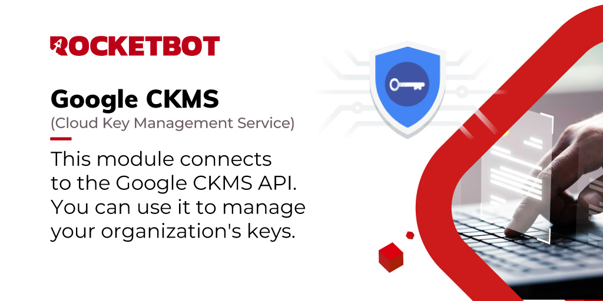

# Google CKMS
  
Este módulo se conecta ao API do Google CKMS. Você pode usá-lo para gerenciar as chaves da sua organização.  

*Read this in other languages: [English](Manual_GoogleCKMS.md), [Português](Manual_GoogleCKMS.pr.md), [Español](Manual_GoogleCKMS.es.md)*
  

## Como instalar este módulo
  
Para instalar o módulo no Rocketbot Studio, pode ser feito de duas formas:
1. Manual: __Baixe__ o arquivo .zip e descompacte-o na pasta módulos. O nome da pasta deve ser o mesmo do módulo e dentro dela devem ter os seguintes arquivos e pastas: \__init__.py, package.json, docs, example e libs. Se você tiver o aplicativo aberto, atualize seu navegador para poder usar o novo módulo.
2. Automático: Ao entrar no Rocketbot Studio na margem direita você encontrará a seção **Addons**, selecione **Install Mods**, procure o módulo desejado e aperte instalar.  

## Como usar este módulo

- Criar um projeto no Google Cloud Console (Pular se você já tiver um projeto criado)
  - No menu à esquerda, clique em Menu > IAM & Admin > Create a project

  - No campo Project Name, adicione um nome para o projeto

  - Complete os campos a seguir conforme necessário

- Habilitar a faturação no projeto
    - No menu à esquerda, clique em Menu > Billing
    - Siga as etapas para habilitar a faturação

- Habilitar a API:
    - Acesse [Google Cloud Console](https://console.cloud.google.com/)
    - No menu no canto superior direito, clique em **Menu** > **APIs & Services** > **Library**
    - No campo de busca, procure por **Cloud Key Management Service (KMS) API**
    - Clique no resultado **Cloud Key Management Service (KMS) API**
    -  Clique no botão **Habilitar**

- Criar credenciais do Google:
    - Acesse [Google Cloud Console](https://console.cloud.google.com/)
    - No menu no canto superior direito, clique em **Menu** > **APIs & Services** > 
**Credentials**
    - Clique no botão **Create credentials**
    - Clique em **OAuth client ID**
    - No campo **Application type**, selecione **Desktop Application**
    - Insira um nome no campo **Name**
    - Uma janela com os dados da credencial será exibida. Clique em **Download JSON**
    - Use este arquivo como credenciais no módulo
## Descrição do comando

### Configurar credenciais G-Suite
  
Configurar as credenciais para conectar com o Google CKMS API
|Parâmetros|Descrição|exemplo|
| --- | --- | --- |
|Caminho de credenciais|Arquivo json com as credenciais de acesso ao API do Google Admin. Veja a documentação para obter mais informações.|C:\Usuario\Desktop\credentials.json|
|Nome da sessão|Nome da sessão que será criada com as credenciais.|session_1|
|Atribuir resultado a variável|Nome da variável onde será atribuído o resultado da execução do comando.|result|

### Criar chaveiro de chaves
  
Crie um chaveiro de chaves no Google CKMS. O comando retornará o caminho do chaveiro de chaves criado.
|Parâmetros|Descrição|exemplo|
| --- | --- | --- |
|Nome do projeto|Nome do projeto onde o chaveiro de chaves será criado.|meu_projeto|
|Nome da localização|Nome da localização onde o chaveiro de chaves será criado.|global|
|Nome do chaveiro de chaves|Nome do chaveiro de chaves que será criado no projeto.|my_key_ring|
|Nome da sessão|Sessão que será utilizada para a execução do comando.|session_1|
|Atribuir resultado a variável|Nome da variável onde será atribuído o resultado da execução do comando.|result|

### Obter todos os chaveiros de chaves
  
Obtenha todos os chaveiros de chaves de um projeto no Google CKMS. O comando retornará uma lista com os chaveiros de chaves.
|Parâmetros|Descrição|exemplo|
| --- | --- | --- |
|Nome do projeto|Nome do projeto onde os chaveiros de chaves serão pesquisados.|meu_projeto|
|Nome da localização|Nome da localização onde os chaveiros de chaves serão pesquisados.|global|
|Nome da sessão|Sessão que será utilizada para a execução do comando.|session_1|
|Atribuir resultado a variável|Nome da variável onde será atribuído o resultado da execução do comando.|result|

### Criar chave simétrica
  
Crie uma chave simétrica no Google CKMS.
|Parâmetros|Descrição|exemplo|
| --- | --- | --- |
|Nome do projeto|Nome do projeto onde o chave simétrica será criada.|meu_projeto|
|Nome da localização|Nome da localização onde o chave simétrica será criada.|global|
|Nome do chaveiro de chaves|Nome do chaveiro onde a chave simétrica será criada.|meu_chaveiro|
|Nome da chave simétrica|Nome da chave simétrica que será criada no projeto.|minha_chave_simétrica|
|Nome da sessão|Sessão que será utilizada para a execução do comando.|session_1|
|Atribuir resultado a variável|Nome da variável onde será atribuído o resultado da execução do comando.|result|

### Criptografar texto simples
  
Criptografa texto simples com uma chave simétrica no Google CKMS. O comando retornará o texto criptografado.
|Parâmetros|Descrição|exemplo|
| --- | --- | --- |
|Nome do projeto|Nome do projeto que contém a chave simétrica usada para criptografar o texto.|meu_projeto|
|Nome da localização|Nome da localização onde a chave simétrica usada para criptografar o texto está localizada.|global|
|Nome do chaveiro de chaves|Nome do chaveiro onde a chave simétrica usada para criptografar o texto está localizada.|meu_chaveiro|
|Nome da chave simétrica|Nome da chave simétrica que será usada para criptografar o texto.|minha_chave_simétrica|
|Texto para criptografar|Texto que será criptografado com a chave simétrica fornecida.|A automação de processos otimiza tarefas repetitivas, reduz erros e aumenta a eficiência operacional.|
|Nome da sessão|Sessão que será utilizada para a execução do comando.|session_1|
|Atribuir resultado a variável|Nome da variável onde será atribuído o resultado da execução do comando.|result|

### Descriptografar texto criptografado
  
Descriptografa texto criptografado com uma chave simétrica no Google CKMS. O comando retornará o texto simples.
|Parâmetros|Descrição|exemplo|
| --- | --- | --- |
|Nome do projeto|Nome do projeto onde a chave simétrica usada para descriptografar o texto está localizada.|meu_projeto|
|Nome da localização|Nome da localização onde a chave simétrica usada para descriptografar o texto está localizada.|global|
|Nome do chaveiro de chaves|Nome do chaveiro onde a chave simétrica usada para descriptografar o texto está localizada.|meu_chaveiro|
|Nome da chave simétrica|Nome da chave simétrica que será usada para descriptografar o texto.|minha_chave_simétrica|
|Texto criptografado|Texto que será descriptografado com a chave simétrica fornecida.|QW1CrUJ6/wXsDHEkRxXXAnGY7fe1dX23vNmrCXkR8NcBDpcTL0FTkwFB|
|Nome da sessão|Sessão que será utilizada para a execução do comando.|session_1|
|Atribuir resultado a variável|Nome da variável onde será atribuído o resultado da execução do comando.|result|
